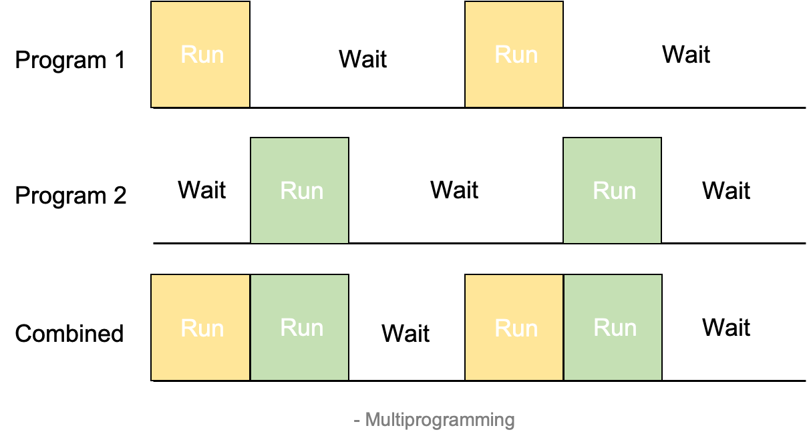

운영체제 정리 첫 번째 글, Overview

---

## 1. Operating System Overview

### 운영체제란?

컴퓨터 시스템의 자원들을 효율적으로 관리하며, 사용자가 컴퓨터를 편리하고 효과적으로 사용할 수 있도록 환경을 제공하는 <mark>소프트웨어</mark>
#### 운영체제가 하는 작업
1. Process 관리(CPU 관리)
2. Main Memory 관리
3. 파일 관리
4. I/O 시스템 관리
5. 디스크 관리(Secondary Storage)
6. Networking, Command-Interpreter System ...

#### Key Interfaces

* Instruction Set Architecture(ISA)
    * 컴퓨터가 따를 수 있는 언어 instruction
    * 하드웨어와 소프트웨어 사이의 경계 인터페이스
* Application Binary Interface(ABI)
    * 프로그램간 휴대성을 위함
    * System call Interface를 정의
* Application programming Interface(API)
    * High-level language 라이브러리

#### Kernel
* 메인 메모리에 들어가 있는 Operating System - OS의 핵심적인 부분 
* Program과 Data의 양이 많이 들어갈 수 있도록 OS의 핵심적 기능만 메인 메모리에 적재

#### Programming 종류
##### 1. Uni-programming
 

프로세서(CPU)는 I/O가 종료될 때 까지 기다림. 한번에 한가지 프로그램만 실행

##### 2. Multi-programming
 

I/O interrupt 발생 시 다른 Job으로 Switch하여 실행  

* 장점: CPU가 기다리는 시간이 줄어듦
* 단점: 큰 메모리 공간 필요

##### 3. Time Sharing
 

워드 프로세서, Web Browser와 같은 대화식 프로그램을 실행할 때 사용되는 multiprogramming 기법  
시간 단위로 번갈아가며 실행: Response Time(반응 시간) 감소

##### - Multi Programming과 Time Sharing의 차이
두 방법 모두 현대 컴퓨터에서 사용함
<table>
<thead>
<tr><td></td><td style="text-align:center">Multi-programming</td><td style="text-align:center">Time-sharing</td></tr>
</thead>
<tbody>
<tr><td>Used for</td><td style="text-align:center">Batch, Back-ground processing</td><td style="text-align:center">Interactive, Foreground processing</td></tr>
<tr><td>Better</td><td style="text-align:center">처리량</td><td style="text-align:center">응답시간</td></tr>
</tbody>
</table>

#### 그 외 개념, 혹은 추후에 정리할 내용들
처리량(Throughput)
: 단위 시간당 처리되는 job의 개수

Process Scheduling
: 어떤 프로그램을 CPU(프로세서)가 다음에 실행할 지 정함

Command-Interpreter System
: User가 OS에게 명령을 내리는 방법 with CLI, GUI

System Call
: 프로그램이 OS에게 해야할 일을 말하는 수단