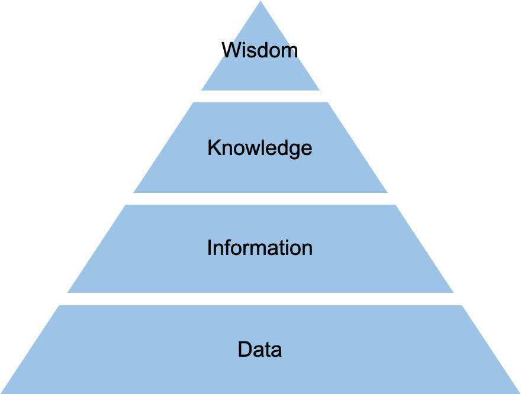

ADSP 자격증 공부 첫 번째 글,

---

## ADSP 1과목

### 1. 데이터의 이해

#### 데이터 유형

정성적 데이터
: 저장·검색·분석에 많은 비용이 소모되는 언어, 문자 형태의 데이터

정량적 데이터
: 정형화된 데이터로 수치, 도형, 기호 등의 형태를 가진 데이터

#### 암묵지와 형식지

<table>
<thead>
<tr>
<td></td>
<td>개념</td>
<td>특징</td>
</tr>
</thead>
<tbody>
<tr>
<td>암묵지</td>
<td>학습과 경험을 통해 개인에게 체화되어 있지만 겉으로 드러나지 않는 지식</td>
<td>공통화, 내면화</td>
</tr>

<tr>
<td>형식지</td>
<td>문서나 메뉴얼처럼 형상화된 지식</td>
<td>표출화, 연결화</td>
</tr>
</tbody>
</table>

#### DIKW

DIKW 피라미드

Data
: 가공하기 전의 순수한 수치/기호

Information
: 상관관계간 이해를 통해 패턴을 인식하고 그 의미를 부여한 데이터

Knowledge
: 상호 연결된 정보 패턴을 이해하여 이를 토대로 예측한 결과물

Wisdom
: 근본 원리에 대한 깊은 이해를 바탕으로 도출되는 아이디어

#### 데이터베이스 유형

통합된 데이터
: 동일한 내용의 데이터가 중복되어 있지 않다.

저장된 데이터
: 컴퓨터가 접근할 수 있는 저장 매체에 저장된다.

공용 데이터
: 여러 사용자가 서로 다른 목적으로 데이터를 공동으로 이용한다.

변화되는 데이터
: 데이터베이스에 저장된 내용은 곧 데이터베이스의 현 시점에서의 상태.

### 2. 데이터의 가치와 미래

#### 빅데이터

##### 빅데이터 특징

- 3V: 규모(Volumne), 속도(Velocity), 형태(Variety)

##### 빅데이터가 만들어 내는 본질적인 변화

1. 사전처리 → 사후처리
- 가능한 한 많은 데이터를 모으고 그 데이터를 다양한 방식으로 조합해 숨은 정보를 찾아냄

2. 표본조사 → 전수조사
- 데이터 처리 기술이 감소함. 이로인해 표본을 조사하는 방식에서 전수조사를 통해 샘플링이 주지 못하는 패턴, 정보를 발견하는 방식으로 변화

3. 질 → 양
- 데이터가 지속적으로 추가될 경우 양질의 정보가 오류 정보보다 많아 전체적으로 좋은 결과 산출에 긍정적 영향

4. 인과관계 → 상관관계
- 데이터 기반의 상관관계 분석이 주는 인사이트가 인과관계에 의한 미래 예측을 점점 더 압도해 갈 것

##### 빅데이터의 가치 산정이 어려운 이유

1. 데이터 활용 방식
- 언제·어디서·누가 활용할지 알 수 없음
2. 새로운 가치 창출
- 데이터가 기존에 없던 가치를 창출함
3. 분석 기술 발전
- 새로운 분석 기법이 등장함에 따라 가치가 높아질 수 있음

→ 가치 산정 어려움

##### 빅데이터의 영향
빅데이터를 통한 혁신/생산성 향상/환경 탐색/상황 분석
  
 → 생활 전반의 스마트화

##### 빅데이터 활용 기본 기술
1. 연관 규칙 학습
- 변인들 간에 주목할 만한 상관관계가 있는지 찾아내는 방법

2. 군집 분석
- 그룹으로 나눌 때 특성에 따라 분류

3. 유전 알고리즘
- 최적화가 필요한 문제의 해결책을 자연선택, 돌연변이 등과 같은 메커니즘을 통해 진화

4. 기계 학습
- 훈련 데이터로부터 학습한 정보를 통해 예측하는 방법

5. 회귀 분석
- 독립변수에 따라 종속변수가 어떻게 변하는지 확인하며 관계를 파악

7. 감정 분석
- 글을 쓴 사람의 감정을 분석

8. 소셜네트워크 분석
- 영향력있는 사람을 찾아낼 때 사용

##### 빅데이터 활용의 3요소

1. 데이터: 모든 것의 데이터화
2. 기술: 진화하는 알고리즘, 인공지능
3. 인력: 데이터 사이언티스트, 알고리즈미스트

#### 위기 요인과 통제 방안
- 사생활 침해 → 동의에서 책임
- 책임 원칙 → 훼손 결과 기반 책임 원칙 고수
- 데이터 오용 → 알고리즘 접근 허용

### 3. 가치창조를 위한 데이터 사이언스와 전략 인사이트

#### 산업별 빅데이터 분석 애플리케이션
금융 서비스
: 신용점수 산정, 사기 탐지, 가격 책정, 프로그램 트레이딩, 클레임 분석, 고객 수익성분석

병원
: 가격 책정, 고객 로열티, 수익 관리

에너지
: 트레이딩, 공급, 수요 예측

정부
: 사기 탐지, 사례관리, 범죄 방지, 수익 최적화

#### 데이터 사이언스

##### 데이터 사이언스의 의미

데이터 사이언스
: 데이터 공학, 수학 통계학, 컴퓨터공학, 시각화, 해커의 사고방식, 해당 분야의 전문 지식을 종합한 학문