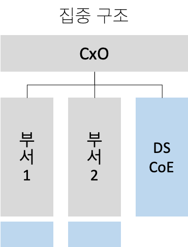
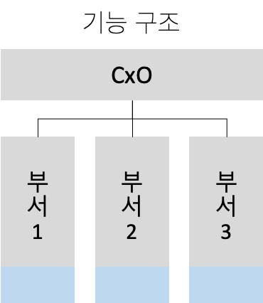
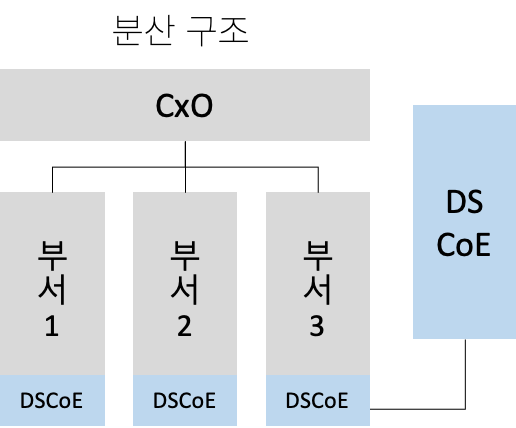

ADSP 자격증 공부 두 번째 글,

---

## ADSP 2과목

### 1. 데이터 분석 기획의 이해

#### 분석 기획 방향성 도출

##### 분석 기획
실제 분석을 수행하기에 앞서 분석을 수행할 과제를 정의하고, 의도했던 결과를 도출할 수 있도록 이를 적절하게 관리할 수 있는 방안을 사전에 계획하는 일련의 작업

##### 분석 대상과 방법

<table>
<thead>
<tr><td>분석 주제 유형</td><td colspan="3">분석의 대상</td></tr>
</thead>
<tbody>
<tr><td rowspan="3">분석의 방법(How)</td><td></td><td>Known</td><td>Unknown</td></tr>
<tr><td>Known</td><td>Optimization</td><td>Insight</td></tr>
<tr><td>UnKnown</td><td>Solution</td><td>Discovery</td></tr>

</tbody>
</table>

##### 분석 기획시 고려사항
- 가용 데이터(Availiable data)에 대한 고려가 필요
- 분석을 통해 가치가 창출될 수 있는 적절한 활용 방안과 유즈케이스 탐색이 필요
- 분석 수행시 발생하는 장애 요소들에 대한 사전 계획 수립이 필요

#### 분석 방법론

##### 기업의 합리적 의사결정을 가로막는 장애요소
고정 관념, 편향된 생각, 프레이밍 효과

##### 업무 특성에 따른 모델
- 폭포수 모델
- 나선형 모델
- 프로토타입 모델

##### KDD와 CRISP-DM 분석 방법론

| <b>KDD분석 방법론</b> | <b>CRISP-DM 분석 방법론</b> | 
| :---: | :---: |
| 1. 데이터셋 선택 |1. 업무 이해|
| 2.데이터 전처리 |2.데이터 이해|
| 3.데이터 변환 |3. 데이터 준비|
|4.데이터 마이닝 |4. 모델링|
| 5.결과 평가 |5.평가|
| |6.전개|

##### 빅데이터 분석방법론

###### 프로세스

- 단계 > 테스크 > 스텝

###### 분석 방법론 5단계

- 분석 기획 > 데이터 준비 > 데이터 분석 > 시스템 구현 > 평가 및 전개

#### 분석과제 발굴 방법론

하향식 접근 방식
: 분석 과제가 주어지고 이에 대한 해법을 찾기 위하여 각 과정이 체계적으로 단계화되어 수행하는 방식

상향식 접근 방식
: 문제의 정의 자체가 어려운 경우 데이터를 기반으로 문제를 지속적으로 개선하는 방식

##### 하향식 접근 방식

| 문제 탐색 | 문제 정의 | 해결방안 탐색 | 타당성 검토
| :--: | :--: | :--: | :--: |
| 비즈니스 모델 기반 문제 탐색   외부사례 기반 문제탐색 | 데이터분석 문제 변환 | 수행 옵션 도출 | 타당성 평가 → 과제선정 |

###### 1) 문제 탐색
- 업무(operation), 제품(product), 고객(customer), 규제와 감사(regulation & audit), 지원 인프라(IT & human resource)등 5가지 영역으로 기업의 비즈니스를 분석

###### 2) 문제 정의
- 비즈니스 문제를 데이터의 문제로 변환하여 정의하는 단계

###### 3) 해결방안 탐색
- 분석 역량, 분석기법 및 시스템으로 해결 방안 탐색, 비즈니스 모델 기반 문제 탐색

###### 4) 타당성 검토
- 경제적 타당성, 데이터 및 기술적 타당성 검토

##### 상향식 접근 방식

기업이 보유하고 있는 다양한 원천 데이터로부터 분석을 통하여 통찰력과 지식을 얻는 접근방법

##### 특징

- 디자인적 사고 접근법을 통해 WHY → WHAT 관점으로 존재하는 데이터 그 자체를 객관적으로 관찰하여 문제를 해결하려는 접근법을 사용
- 시행착오를 통한 문제 해결 : 프로토타이핑 접근 법
- 비지도 학습 방법으로 수행되며, 데이터 자체의 결합, 연관성, 유사성을 중심으로 접근

##### 분석과제 정의
- 분석 과제 정의서를 통해 분석별 필요 소스 데이터, 분석 방법, 데이터 입수 및 분석의 난이도, 분석 수행주기, 검증 오너십, 상세 분석 과정 등을 정의

#### 프로젝트 관리 방안

##### 분석과제 관리를 위한 5가지 주요 항목

- Data Complexity(데이터 복잡성)
- Speed(속도)
- Analytic Complexity(분석 복잡도)
- Accuracy & Precision(정확도와 정밀도)
- Data Size(데이터 크기)

##### 분석 프로젝트의 특성

- 분석가의 목표: 개별적인 분석 업무 수행 뿐만 아니라 전반적인 프로젝트 관리 또한 중요
- 분석가의 입장: 데이터 영역과 비즈니스 영역의 현황을 이해, 분석의 정확도 달성과 결과에 대한 가치 이해를 전달하는 조정자로서의 역할
- 프로토타이핑 방식의 애자일 프로젝트 관리방식에 대한 고려도 필요

### 2. 분석 마스터 플랜

마스터 플랜 수립 프레임워크

<table>
<thead>
<tr><td colspan="2" style="text-align:center">우선순위 고려요소</td><td colspan="2" style="text-align:center">적용범위/방식 고려요소</td></tr>
</thead>
<tbody>
<tr>
<td style="width:30%">전략적 중요도</td><td rowspan="3" style="width:20%; text-align:center; vertical-align:middle">적용 우선 순위 설정</td><td style="width:30%">업무 내재화 적용 수준</td><td rowspan="3"  style="text-align:center; width:20%; vertical-align:middle">Analytics 구현   로드 맵 수립</td>
</tr>

<tr>
<td>비즈니스 성과/ROI</td><td>분석 데이터 적용 수준</td>
</tr>

<tr>
<td>실행 용이성</td><td>기술 적용 수준</td>
</tr>
</tbody>
</table>

##### 빅데이터의 핵심 특징

<table>
<tr><td rowspan="4" style="width:15%; text-align:center; vertical-align:middle">4V  비즈니스 효과</td><td rowspan="3" style="width:15%; text-align:center; vertical-align:middle">3V  투자비용 효과</td><td>크기 - Volume</td></tr>
<tr><td>다양성 - Variety</td></tr>
<tr><td>속도 - Velocity</td></tr>
<tr><td></td><td>가치 - Value </td></tr>
</table>

#### 분석 거버넌스 체계 수립

##### 분석 거버넌스 체계 구성요소

- Process: 과제 기획 및 운영 프로세스 
- System: 분석 관련 시스템
- Data: 데이터 
- Human Resource:분석 교육/마인드 육성체계
- Organization: 분석 기획 및 관리 수행 조직

##### 데이터 거버넌스

- 전사 차원의 모든 데이터에 대하여 정책 및 지침, 표준화, 운영조직 및 책임 등의 표준화 된 관리 체계를 수립하고 운영을 위한 프레임워크 및 저장소를 구축하는 것을 말함.
- 마스터 데이터, 메타 데이터, 데이터 사전은 데이터 거버넌스의 중요한 관리 대상

###### 구성 요소
- 원칙, 조직, 프로세스

###### 데이터 거버넌스 체계
- 데이터 표준화, 데이터 관리 체계, 데이터 저장소 관리, 표준화 활동

##### 데이터 분석을 위한 3가지 조직 구조

<dl>
<dt>

</dt>

<dd>
<b>집중 구조</b>
</dd>
<dd>
<ul>
<li>전사 분석 업무를 별도의 분석 전담 조직에서 담당</li>
<li>전략적 중요도에 따라 분석 조직이 우선순위를 정해서 진행 가능</li>
<li>현업 업무부서의 분석업무와 이중화/이원화 가능성 높음</li>
</ul>
</dd>

</dl>

<dl>
<dt>

</dt>

<dd>
<b>기능 구조</b>
</dd>
<dd>
<ul>
<li>일반적인 분석 수행 구조</li>
<li>별도 분석 조직이 없고 해당 업무 부서에서 분석 수행</li>
<li>전사적 핵심 분석이 어려우며 부서 현황 및 실적 통계 등 과거 실적에 국한된 분석 수행 가능성 높음</li>
</ul>
</dd>

</dl>

<dl>

<dt>

</dt>

<dd>
<b>분산 구조</b>
</dd>
<dd>
<ul>
<li>분석 조직 인력들을 현업부서로 직접 배치하여 분석업무 수행</li>
<li>전사 차원의 우선순위 수행</li>
<li>분석 결과에 따른 신속한 Action가능</li>
<li>부서 분석 업무와 역할 분담 명확히 해야함</li>
→ 업무과다 이원화 가능성
</ul>
</dd>

</dl>

##### 분석 과제 관리 프로세스
1. 분석 아이디어 발굴
2. 분석 과제 후보 제안
3. 분석 과제 확정
4. 팀 구성
5. 분석 과제 실행
6. 분석 과제 진행 관리
7. 결과 공유/개선