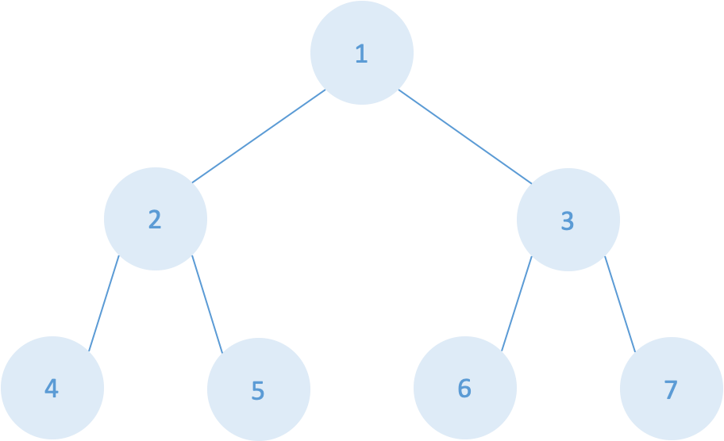
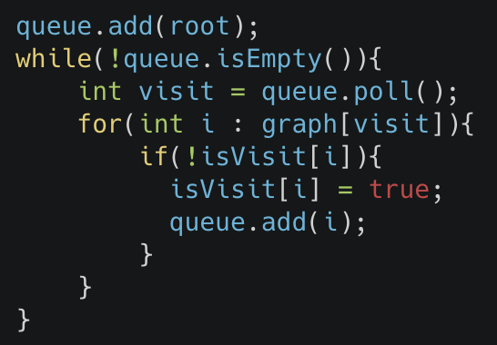

알고리즘 BFS 정리

---

## 코딩 테스트를 위한 알고리즘 정리글

### Breadth-First Search

사용 시점
: 미로 관련한 문제 때 쓰는 듯함(배열 관련 해결 방향)   (집합은 DFS)
 

#### Breadth-First Search 기본 사용법

<mark>일반적으로 이렇게 했고, 문제에 따라서 유동적으로 적용해야함</mark>

##### 접근 방향

- DFS는 배열에서 n번째 세팅하고 n+1가는 느낌이라면 BFS는 너비 우선탐색이라 Queue 써야함
- DFS: 1-2-4-2-5-1-3-6-7(스택)
- BFS: 1-2-3-4-5-6-7(큐)
- 루트 노드 넣고 Queue가 isEmpty일때까지 반복.
- 루트 노드 방문 후 자식 노드 추가

#### 의사코드

