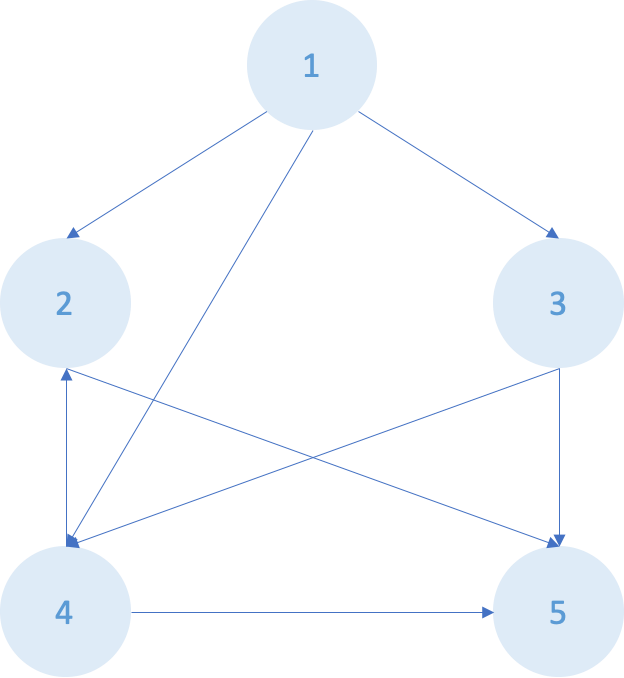

알고리즘 Dijkstra 정리

---

## 코딩 테스트를 위한 알고리즘 정리글

### Dijkstra

사용 시점
: 하나의 정점에서 다른 정점들까지의 최단거리 구하기

1. 그래프가 있을 때, 시작 정점은 0으로 나머지는 INF로 초기화
2. 가장 가까운 정점 s 선택(첫 번째: 시작 정점)
3. 정점 x 거리 = Math.min(정점 x 거리, 정점 s 거리 + s-x 간 가중치)
4. 업데이트 후, 그 다음으로 가까운 정점 선택
5. 2-4 반복

우선순위 큐로도 가능함(Priority Queue - 꺼내기: poll, 넣기: offer)

1. 처음 정점 선택 후 정점과 연결된 노드들 queue에 넣음(거리와 INDEX 필요)
2. 거리 배열에 거리 계산하여 넣음
3. 이때, 업데이트 한 거리가 더 짧을 때 queue에 다시 넣어준다.
